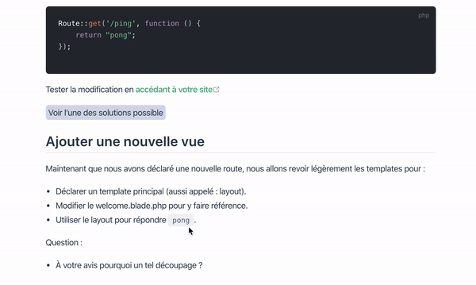

# Click To Reveal component for VuePress 📋 

Simple plugin for VuePress to add a "Click To Reveal" on your pages

## Installation

Copy the `Reveal.vue` file to your `.vuepress/components/` folder

## Usage

Express usage

```md
<Reveal>
 Some hidden contents
</Reveal>
```

With a custom label

```md
<Reveal text="Show me the magic 😅">
 Some hidden contents
</Reveal>
```

## Demo


